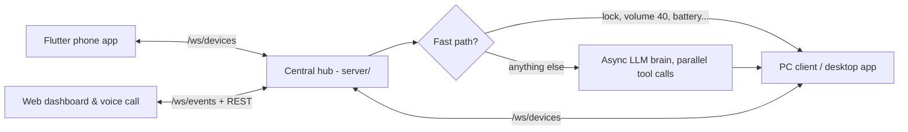
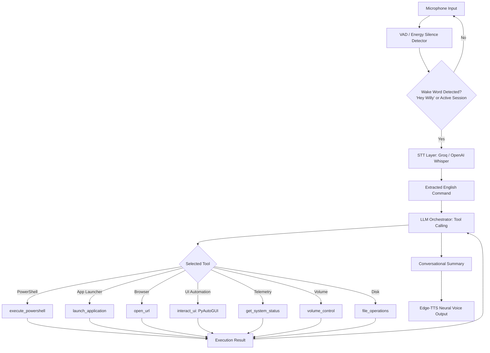

# Willy: Autonomous Voice-Driven Windows System Controller

**Willy** is an autonomous, English-speaking Windows co-pilot and system controller daemon built in Python. Inspired by modern voice interfaces like Google Gemini, Willy listens through your microphone, detects wake words ("Hey Willy" / "Willy"), transcribes voice commands with ultra-low latency, reasons with an LLM using native **Function Calling / Tool Execution**, performs real Windows system actions, and speaks back with natural neural speech.

---

## Three-tier realtime setup (v3)



| Part | Run it | What it does |
| :--- | :--- | :--- |
| `server/` | `python -m server.main` | Hub + AI brain. Pushes every heartbeat and command to all screens live; answers simple commands in ~10 ms without the LLM; fires reminders/alarms on every device. |
| `pc_client/` | `python pc_client/main.py` (add `--cli` for headless) | Streams live telemetry every 2 s (CPU, RAM, disk, battery, network speed, active window, idle time, top processes) and executes actions in parallel worker threads. |
| `mobile_app/` | `flutter run` | Live device dashboard, remote + assistant chat, live screen mirror, task manager, voice calls, activity feed, reminders & alarms. |

What changed in v3:
- **Realtime everywhere**: hub pushes `device_update` / `activity` / `reminder_due` events over WebSockets; nothing polls. Real round-trip latency is measured on every heartbeat.
- **Faster**: fast-path router (lock, volume, media, open apps/sites, battery/CPU/RAM questions) skips the LLM; the LLM is fully async with per-client conversations and parallel multi-tool calls; PC telemetry collection went from seconds to ~30 ms (single `NtQuerySystemInformation` process snapshot).
- **More features**: exact volume control, brightness, process list / end task, notifications and speech on the PC, open folders, type text / hotkeys, live screen mirror with quality presets, phone ring / flashlight / vibrate / QuickDrop, activity log with latency breakdowns, reminders that actually fire.
- **Security**: web pages no longer embed the access token (you sign in once per browser). Set a long random `WILLY_REMOTE_TOKEN` in `server/.env`, the PC client and the phone app; the hub warns loudly while the public default is in use.

### What's new in v3.1: phone skills, presence and watchdog

- **Works while devices are offline.** Reminders, timers, alarms and watchdog requests run on the hub, so "remind me to stretch in 30 minutes" works even when the PC is asleep. Requests that need an offline device say since when and why ("HariG has been offline since 9:42 PM (12 minutes): the PC went to sleep") and give last-known values ("it was at 82 percent when it was last online").
- **Why a device is offline.** The PC tells the hub when the app closes, the PC sleeps, shuts down or you sign out; otherwise the hub infers "connection dropped" or "stopped responding". The hub remembers devices (and their last state) across restarts for 7 days. Dashboards show the reason on each device.
- **Watchdog.** "Tell me when my PC is online", "turn on the watchdog", or "when my laptop is back, tell me what's using the CPU". Alerts pop up on the phone (and every other screen); offline alerts wait 20 s, so quick reconnects don't ping you. REST: `GET/POST /api/v1/watches`, `DELETE /api/v1/watches/{id}`.
- **Phone skills (Gemini-style).** Call, text (SMS), WhatsApp (opens with the message ready: tap send), open apps, alarms and timers in the Clock app, volume, music control, navigation, read recent notifications, flashlight, find my phone. Grant the permissions in the app: Settings > Phone skills.
- **From the PC:** the Willy PC app has a **Phone** page (live status, notifications, all phone actions) and a "Ring my phone" tray item. "Send this chat to my PC" / "show this on my PC" open notes on the PC.
- **Faster, cheaper AI.** More commands skip the AI entirely (reminders, timers, presence, find my phone). Actions whose result is already a sentence skip the second AI round. When the main model hits its daily quota, Willy switches to the next one (`LLM_FALLBACK_MODELS`) and says plainly when nothing is left.
- **Inside PC apps.** `type_text` drafts text into any app (WhatsApp Desktop, Claude, Notepad, Word) and leaves Enter/Send to you; `read_window_text` reads what a window shows (UI Automation), e.g. new chat messages or Claude's answer. Messages are never sent without you pressing Send (WhatsApp on the phone also opens ready to send).
- **Safer PowerShell.** Commands that install/uninstall software, delete, download or change system settings need your explicit "yes" first; the brain can't approve them on its own. Tool calls a model writes as text (`<tool_call>...`) are recognised and handled instead of being shown to you.
- **Voice.** The web voice call waits longer after short phrases ("open ... chrome") and ignores noise-only transcripts.

### Willy PC app: exe, system tray and Start with Windows

```powershell
python build_pc_exe.py --autostart   # builds dist\WillyPC\WillyPC.exe, adds a "Willy PC" Start menu entry,
                                     # and starts it hidden in the tray at every Windows sign-in
```

- **Where it is:** `dist\WillyPC\WillyPC.exe`, or Start menu > **Willy PC**. The build copies `pc_client/.env` (hub URL + token) to `dist\WillyPC\.env`; edit that file, or rebuild, to change hubs. Rebuilding closes the running copy first.
- **System tray:** Willy lives in the notification area, in the hidden icons flyout (^) by default; drag the icon onto the taskbar to keep it visible. The dot shows the hub connection (green online, amber connecting, red offline). Left-click opens the window; right-click gives **Open Willy**, **Web dashboard**, **Voice call**, **Reconnect to hub**, **Start with Windows** (tick) and **Quit Willy**.
- **Closing the window hides it to the tray.** Willy keeps serving the phone and the dashboard; use **Quit Willy** in the tray menu to stop it. Starting Willy again while it runs just brings the window back (one copy per PC).
- **Start with Windows** is a per-user entry named `WillyPC` (Task Manager > Startup apps; no admin rights needed). It launches `WillyPC.exe --tray`, or `pythonw pc_client/main.py --tray` when enabled from a source run, and it replaces the old assistant's `WillyVoiceAssistant` entry. From a terminal: `python pc_client/main.py --enable-autostart | --disable-autostart | --autostart-status`.
- The exe runs without admin rights (Windows doesn't start apps that demand elevation at sign-in); the Tools page still asks for elevation where it's needed. Windowless runs (the exe, `pythonw`) log to `%LOCALAPPDATA%\WillyPC\willy-pc.log`.
- **Slow DNS (phone hotspots):** if looking up the hub takes over 2.5 s, Willy dials the hub's last known address instead (saved in `%LOCALAPPDATA%\WillyPC\hub_address.json`); TLS still checks the hub's real certificate. On a hotspot whose DNS takes ~12 s, this brings a sign-in start online in about 4 s.

---

## Key Features

- **Wake-Word & Active Follow-up Sessions**:
  - Say **"Hey Willy"** or **"Willy"** to wake.
  - **Conversational Follow-Up Mode**: After waking, Willy keeps an active session open for 10 seconds. You can issue follow-up commands without repeating the wake word every time!
- **Fast Audio STT**:
  - Integrated with **Groq Whisper** (`whisper-large-v3`) for sub-300ms transcription latency.
  - Seamless fallback or support for **OpenAI Whisper**.
- **Deterministic Windows Execution Engine**:
  - `execute_powershell`: Execute administrative or user-level PowerShell commands safely with stdout/stderr capture and timeout protection.
  - `launch_application`: Launch any Windows executable, UWP app (`calc`, `notepad`, `chrome`, `spotify`, etc.), or file path.
  - `open_url`: Open websites in your default browser.
  - `interact_ui`: Keystrokes, keyboard shortcuts (`win+d`, `ctrl+c`, `alt+tab`), text typing, and mouse interactions via `PyAutoGUI`.
  - `get_system_status`: Live CPU, RAM, disk, battery percentage, and active window title.
  - `volume_control`: Mute, unmute, or adjust system master volume.
  - `file_operations`: Read, write, list files on disk.
- **Natural Voice Feedback**:
  - High-fidelity neural voice powered by Microsoft `edge-tts` (e.g. `en-US-ChristopherNeural`), with offline fallback to Windows SAPI5 (`pyttsx3`).
- **Flexible Operating Modes**:
  - Continuous Voice Mode (hands-free)
  - Push-To-Talk Mode
  - Interactive Text Mode (for testing without microphone)

---

## Architecture Overview



---

## Installation & Setup

### 1. Prerequisites
- **Windows 10 / 11**
- **Python 3.10+** (Tested on Python 3.12)
- Working microphone and audio output device.

### 2. Install Dependencies
In your PowerShell or Command Prompt:

```powershell
pip install -r requirements.txt
```

### 3. Configure API Keys & Environment
Copy `.env.example` to `.env`:

```powershell
copy .env.example .env
```

Open `.env` and configure your keys:
```ini
# Recommended for lowest latency:
LLM_PROVIDER=groq
STT_PROVIDER=groq
GROQ_API_KEY=gsk_your_groq_api_key_here
GROQ_MODEL=llama-3.3-70b-versatile

# Or if you prefer OpenAI:
# LLM_PROVIDER=openai
# STT_PROVIDER=openai
# OPENAI_API_KEY=sk-your_openai_key_here
# OPENAI_MODEL=gpt-4o

# Wake words (comma-separated)
WAKE_WORDS=willy,hey willy,willy wake up

# Voice selection (Edge-TTS Microsoft Neural voices)
TTS_PROVIDER=edge-tts
TTS_VOICE=en-US-ChristopherNeural
```

> **Where to get free Groq API key?**  
> Go to [console.groq.com](https://console.groq.com/keys) to get a free API key with very high rate limits and fast Whisper STT.

---

## Running Willy

### Mode 1: Continuous Hands-Free Voice Mode (Default)
Listens ambiently for "Hey Willy":

```powershell
python main.py --mode voice
```

### Mode 2: Push-to-Talk Mode
Press `Enter`, speak your request, and release:

```powershell
python main.py --mode push-to-talk
```

### Mode 3: Interactive Text Mode
Test any tool and prompt without needing a microphone or audio hardware:

```powershell
python main.py --mode text
```

### Auto-Start with Windows (Start on PC Boot / Logon)
> These commands start the **standalone assistant** (`main.py`). For the hub-connected Willy PC app, use **Start with Windows** in its tray menu or `python build_pc_exe.py --autostart` (see [the Willy PC app section](#willy-pc-app-exe-system-tray-and-start-with-windows)); turning that on replaces this entry.

Make Willy launch automatically on its own whenever you turn on or log in to your PC:

- **Via Python CLI:**
  ```powershell
  python main.py --enable-autostart ui    # Enable autostart with floating widget
  python main.py --autostart-status       # Check current autostart status
  python main.py --disable-autostart      # Disable autostart
  ```
- **Via Interactive Menu:** Run `willy.bat` and choose option `[5]` to enable or `[6]` to disable.
- **Via One-Click Scripts:** Double-click `scripts\enable_autostart.bat` or `scripts\disable_autostart.bat`.
- **Silent Background Launcher:** Use `start_willy_silent.vbs` to launch Willy windowless via `pythonw.exe`.

---

## Example Voice Commands to Try

| Voice Command | Action Taken by Willy |
| :--- | :--- |
| *"Hey Willy, make sure you start on your own"* | Enables Windows auto-start so Willy runs on boot |
| *"Hey Willy, open Spotify and launch Chrome"* | Launches both Spotify and Google Chrome |
| *"Hey Willy, what's my battery and CPU usage?"* | Inspects telemetry and speaks status out loud |
| *"Hey Willy, show desktop"* | Presses `Win + D` hotkey to minimize all windows |
| *"Hey Willy, open YouTube"* | Opens `https://youtube.com` in default browser |
| *"Hey Willy, mute system volume"* | Toggles master audio mute |
| *"Hey Willy, open PowerShell and check my IP address"* | Runs `Get-NetIPAddress` or `ipconfig` and summarizes your local IP |
| *"Hey Willy, create a notes file on my desktop called ideas.txt"* | Uses filesystem tools to create the file |

---

## Windows Microphone Permissions Check

If Willy does not pick up your voice:
1. Open Windows **Settings** (`Win + I`).
2. Go to **Privacy & security** > **Microphone**.
3. Ensure **Microphone access** is toggled **ON**.
4. Ensure **Let desktop apps access your microphone** is toggled **ON**.

---

---

## Running Automated Tests

To verify all system tools, registry schemas, and session management:

```powershell
python tests/test_willy.py
```

---

## Project Structure

```text
├── main.py                     # Entry point for Willy (UI, voice, push-to-talk, text)
├── willy.bat                   # Master interactive Windows launcher
├── .env                        # Local credentials (API keys, wake word, settings)
├── .env.example                # Template configuration
├── requirements.txt            # Python dependencies
├── scripts/                    # Direct batch startup scripts (UI, voice, remote, text)
├── shortcuts/                  # Apple Shortcuts for iOS Siri integration
├── tests/                      # Automated unit & verification test suites
└── willy/                      # Core Willy application package
    ├── agent/                  # LLM reasoning, deterministic local router, system prompts
    ├── audio/                  # STT (Whisper), TTS (Neural/Edge), VAD, wake-word detection
    ├── server/                 # Remote gateway & WebSocket bridge for Siri / mobile
    ├── tools/                  # Windows system, vision, multi-monitor, file search, apps
    └── ui/                     # Floating desktop voice visualizer widget
```
